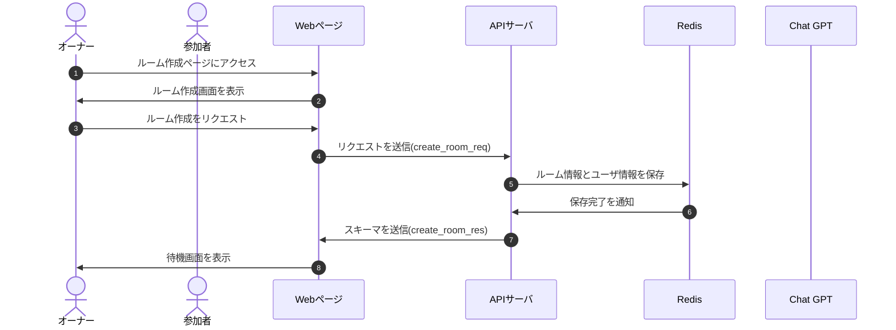

# DesignDoc

## ルーム作成機能について

### 概要

ルームを作成する。

### 詳細

ルームを作成した人がオーナーになる。  
ルーム作成時に`userID`と`roomID`を発行する。  
ルーム設定時に my 設定を入れる

### シーケンス図

### スキーマ

[create_room_req](/docs/DesignDog/schema/01_ルーム作成/create_room_req.json)  
[create_room_res](/docs/DesignDog/schema/01_ルーム作成/create_room_res.json)

執筆日：2024/01/14 15:19
