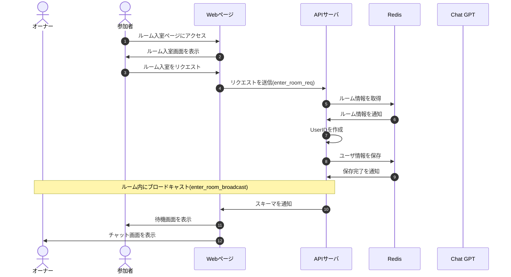

# DesignDoc

## ルール入室機能について

### 概要

ルームに入室する。

### 詳細

ルームに入室後`userID`を発行する

### シーケンス図

### スキーマ

[enter_room_req](/docs/DesignDog/schema/02_ルーム入室/enter_room_req.json)  
[enter_room_broadcast](/docs/DesignDog/schema/02_ルーム入室/enter_room_broadcast.json)

執筆日：2024/01/14 16:50
