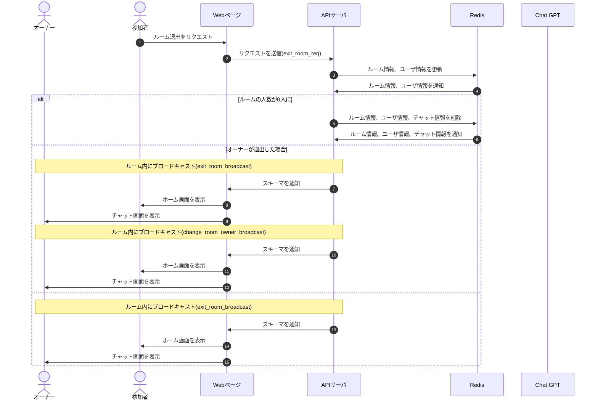

# DesignDoc

## ルーム退出機能について

### 概要

### 詳細

オーナーが退出した場合はサーバー側で新しいオーナーを決めて改めて通知する  
退出者は退出のスキーマ(exit_room_req)を送信した段階で，ルーム退出する．WebSocket の通信遮断時(onClose)の時にも同様に退出のスキーマ(exit_room_req)を送信する．  
ルーム退出時に観戦者がいる場合、観戦者の中で一番早く入室していた人を参加者に変更する.

### シーケンス図

### スキーマ

[exit_room_req](/docs/DesignDog/schema/03_ルーム退出/exit_room_req.json)  
[exit_room_broadcast](/docs/DesignDog/schema/03_ルーム退出/exit_room_broadcast.json)  
[chage_room_owner_broadcast](/docs/DesignDog/schema/03_ルーム退出/change_room_owner_broadcast.json)

執筆日：2024/01/14 16:50
