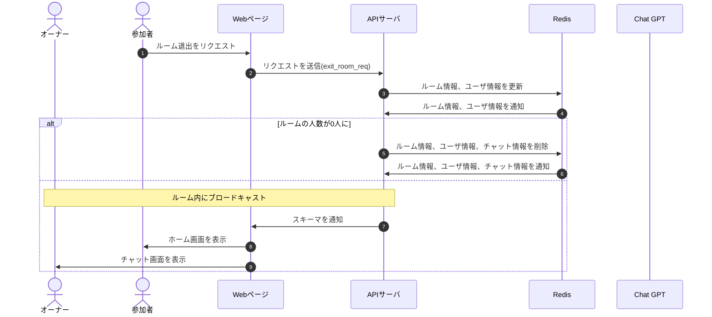

# DesignDoc

## ルーム退出機能について

### 概要

### 詳細

### シーケンス図

```mermaid
sequenceDiagram
    autonumber
    actor owner as オーナー
    actor participants as 参加者
    participant front as Webページ
    participant api as APIサーバ
    participant db as Redis
    participant ai as Chat GPT

    participants->>front: ルーム退出をリクエスト
    front->>api: リクエストを送信(exit_room_req)
    api->>db: ルーム情報、ユーザ情報を更新
    db->>api: ルーム情報、ユーザ情報を通知
    alt ルームの人数が0人に
        api->>db: ルーム情報、ユーザ情報、チャット情報を削除
        db->>api: ルーム情報、ユーザ情報、チャット情報を通知
    else
        Note over owner,api: ルーム内にブロードキャスト
        api->>front: スキーマを通知
        front->>participants: ホーム画面を表示
        front->>owner: チャット画面を表示
    end
```

### スキーマ

[exit_room_req](/docs/DesignDog/schema/03_ルーム退出/exit_room_req.json)

執筆日：2024/01/14 16:50
