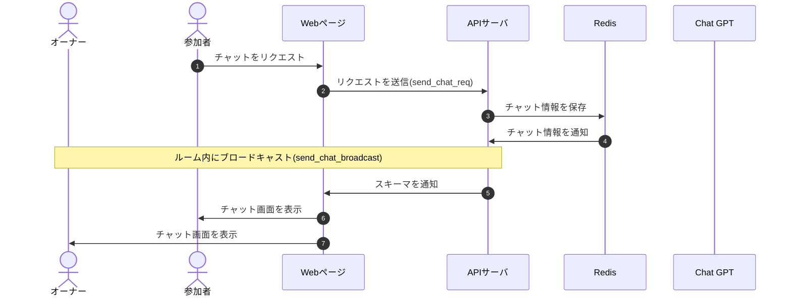

# DesignDoc

## チャット機能について

### 概要

### 詳細

### シーケンス図

### スキーマ

[send_chat_req](/docs/DesignDog/schema/04_チャット機能/send_chat_req.json)  
[send_chat_broadcast](/docs/DesignDog/schema/04_チャット機能/send_chat_broadcast.json)

執筆日：2024/01/14 16:50
