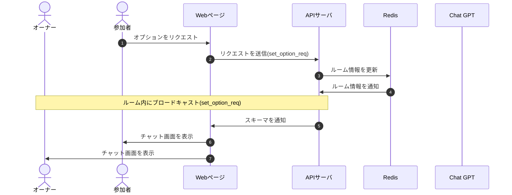

# DesignDoc

## オプション選択機能について

### 概要

### 詳細

オプションの変更はオーナーのみ可能  
参加者は更新の様子をリアルタイムに閲覧することができる

### シーケンス図

### スキーマ

[set_option_req](/docs/DesignDog/schema/05_オプション選択/set_option_req.json)  
[set_option_broadcast](/docs/DesignDog/schema/05_オプション選択/set_option_broadcast.json)

執筆日：2024/01/14 16:51
