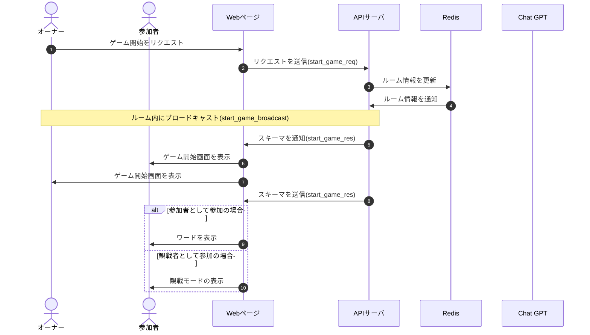

# DesignDoc

## ゲーム開始機能について

### 概要

### 詳細

ゲーム開始のブロードキャストの後，個別でデータを送る．参加者の場合はワードが送られる

### シーケンス図

### スキーマ

[start_game_req](/docs/DesignDog/schema/06_ゲーム開始/start_game_req.json)  
[start_game_broadcast](/docs/DesignDog/schema/06_ゲーム開始/start_game_broadcast.json)  
[start_game_res](/docs/DesignDog/schema/06_ゲーム開始/start_game_res.json)

執筆日：2024/01/14 16:51
