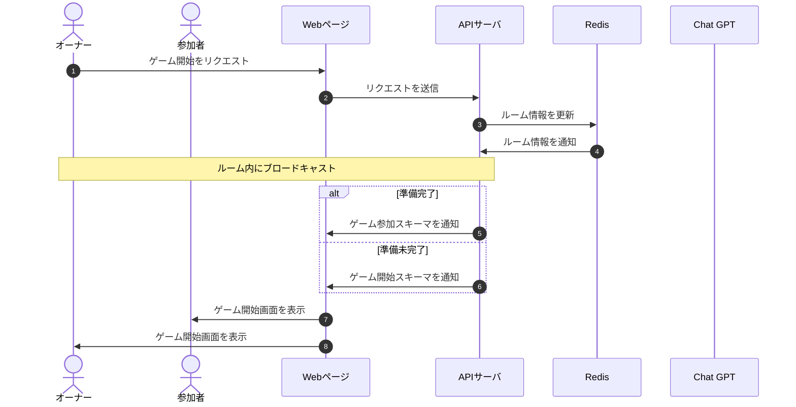

# DesignDoc

## ゲーム開始機能について

### 概要

### 詳細

### シーケンス図

```mermaid
sequenceDiagram
    autonumber
    actor owner as オーナー
    actor participants as 参加者
    participant front as Webページ
    participant api as APIサーバ
    participant db as Redis
    participant ai as Chat GPT

    owner->>front: ゲーム開始をリクエスト
    front->>api: リクエストを送信
    api->>db: ルーム情報を更新
    db->>api: ルーム情報を通知
    Note over owner,api: ルーム内にブロードキャスト
    alt 準備完了
        api->>front: ゲーム参加スキーマを通知
    else 準備未完了
        api->>front: ゲーム開始スキーマを通知
    end
    front->>participants: ゲーム開始画面を表示
    front->>owner: ゲーム開始画面を表示
```

### スキーマ

執筆日：2024/01/14 16:51
