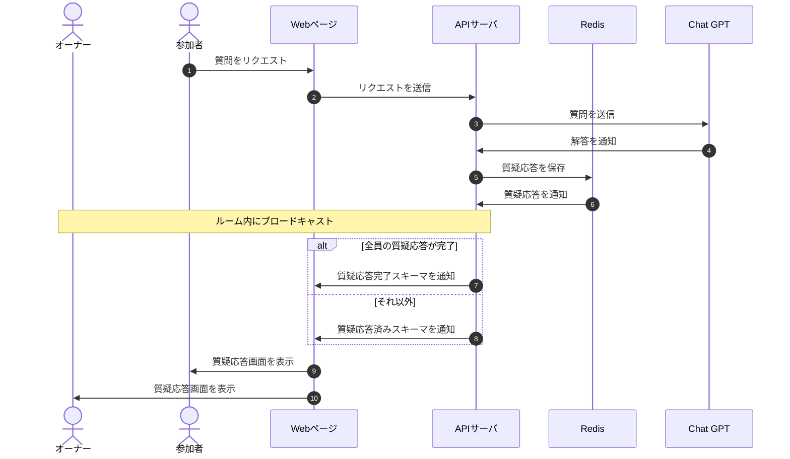

# DesignDoc

## 質疑応答機能について

### 概要

### 詳細

### シーケンス図

```mermaid
sequenceDiagram
    autonumber
    actor owner as オーナー
    actor participants as 参加者
    participant front as Webページ
    participant api as APIサーバ
    participant db as Redis
    participant ai as Chat GPT

    participants->>front: 質問をリクエスト
    front->>api: リクエストを送信
    api->>ai: 質問を送信
    ai->>api: 解答を通知
    api->>db: 質疑応答を保存
    db->>api: 質疑応答を通知
    Note over owner,api: ルーム内にブロードキャスト
    alt 全員の質疑応答が完了
        api->>front: 質疑応答完了スキーマを通知
    else それ以外
        api->>front: 質疑応答済みスキーマを通知
    end
    front->>participants: 質疑応答画面を表示
    front->>owner: 質疑応答画面を表示
```

### スキーマ

執筆日：2024/01/14 16:54
