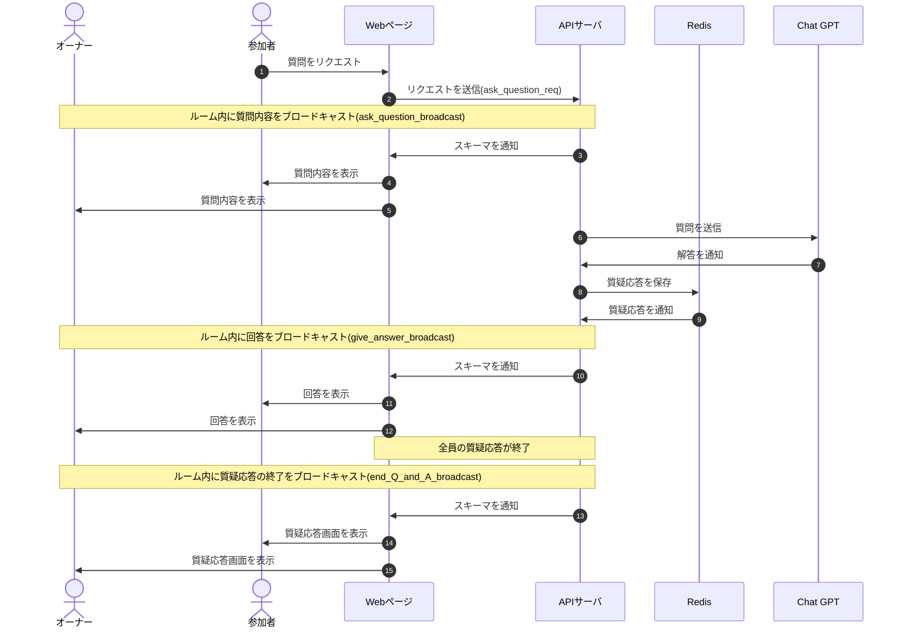

# DesignDoc

## 質疑応答機能について

### 概要

### 詳細

### シーケンス図

### スキーマ

[ask_question_req](/docs/DesignDog/schema/09_質疑応答/ask_question_req.json)  
[ask_question_broadcast](/docs/DesignDog/schema/09_質疑応答/ask_question_broadcast.json)  
[give_answer_broadcast](/docs/DesignDog/schema/09_質疑応答/give_answer_broadcast.json)  
[end_Q_and_A_broadcast](/docs/DesignDog/schema/09_質疑応答/end_Q_and_A_broadcast.json)

執筆日：2024/01/14 16:54
