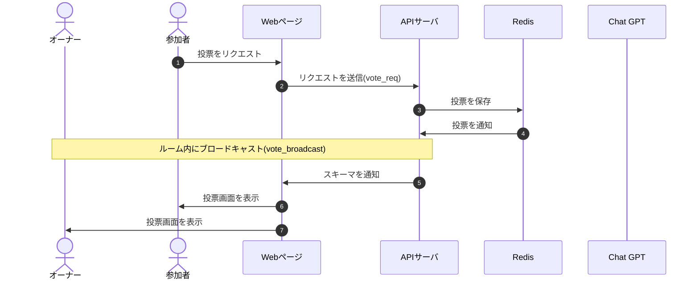

# DesignDoc

## 投票機能について

### 概要

### 詳細

### シーケンス図

### スキーマ

[vote_req](/docs/DesignDog/schema/10_投票/vote_req.json)  
[vote_broadcast](/docs/DesignDog/schema/10_投票/vote_broadcast.json)

執筆日：2024/01/14 16:54
