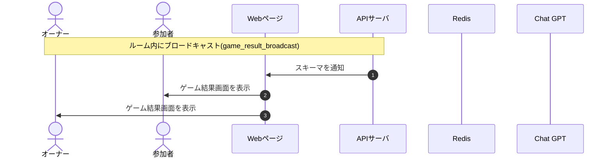

# DesignDoc

## ゲーム結果機能について

### 概要

### 詳細

### シーケンス図

```mermaid
sequenceDiagram
    autonumber
    actor owner as オーナー
    actor participants as 参加者
    participant front as Webページ
    participant api as APIサーバ
    participant db as Redis
    participant ai as Chat GPT

    Note over owner,api: ルーム内にブロードキャスト(game_result_broadcast)
    api->>front: スキーマを通知
    front->>participants: ゲーム結果画面を表示
    front->>owner: ゲーム結果画面を表示
```

### スキーマ

[game_result_broadcast](/docs/DesignDog/schema/11_ゲーム結果/game_result_broadcast.json)

執筆日：2024/01/14 16:54
