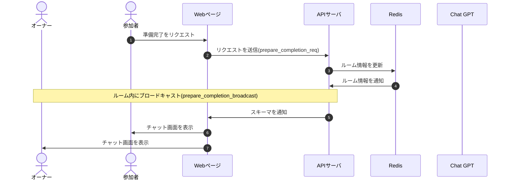

# DesignDoc

## 準備完了機能について

### 概要

### 詳細

準備完了をリクエスト出来るのは参加者のみ。

### シーケンス図

### スキーマ

[prepare_completion_req](/docs/DesignDog/schema/01_ルーム作成/create_room_req.json)  
[prepare_completion_res](/docs/DesignDog/schema/01_ルーム作成/create_room_res.json)

執筆日：2024/01/19 0:37
