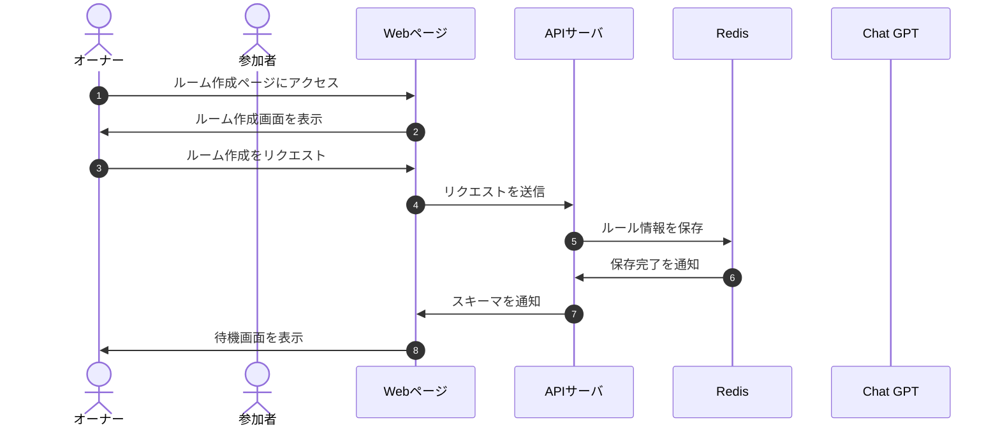

# DesignDoc

## ルーム作成機能について

### 概要

ルームを作成する。

### 詳細

ルームを作成した人がオーナーになる。  
ルーム作成時に roomID を発行する。

### シーケンス図

```mermaid
sequenceDiagram
    autonumber
    actor owner as オーナー
    actor participant as 参加者
    participant front as Webページ
    participant api as APIサーバ
    participant db as Redis
    participant ai as Chat GPT

    owner->>front: ルーム作成ページにアクセス
    front->>owner: ルーム作成画面を表示
    owner->>front: ルーム作成をリクエスト
    front->>api: リクエストを送信
    api->>db: ルール情報を保存
    db->>api: 保存完了を通知
    api->>front: スキーマを通知
    front->>owner: 待機画面を表示
```

### スキーマ

執筆日：2024/01/14 15:19
