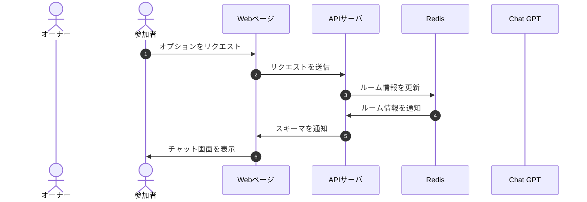

# DesignDoc

## オプション選択機能について

### 概要

### 詳細

### シーケンス図

```mermaid
sequenceDiagram
    autonumber
    actor owner as オーナー
    actor participants as 参加者
    participant front as Webページ
    participant api as APIサーバ
    participant db as Redis
    participant ai as Chat GPT

    participants->>front: オプションをリクエスト
    front->>api: リクエストを送信
    api->>db: ルーム情報を更新
    db->>api: ルーム情報を通知
    api->>front: スキーマを通知
    front->>participants: チャット画面を表示
```

### スキーマ

執筆日：2024/01/14 16:51
